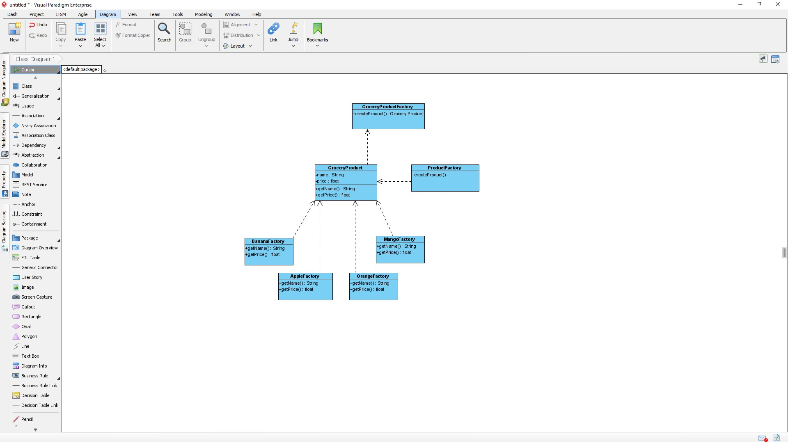

# Assignment 1: Design Patterns (Java)

## Description
This repository contains the Java implementation of a design pattern assignment that involves using an Abstract Factory to create products for a grocery store and setting the price of the product using a Factory Method pattern. The price of the product is read from a database (in this case, the "Grocery.txt" file) containing product names and prices.

## Repository Structure
  - **Cost.java**: Define a class for representing product prices.
  - **GroceryProd.java**: Define interfaces or base classes for grocery products.
  - **Mango.java**: Implement the "Mango" product class.
  - **Orange.java**: Implement the "Orange" product class.
  - **GroceryProdFactory.java**: Implement the Abstract Factory pattern for creating grocery products.
  - **MangoFactory.java**: Implement the Factory for creating "Mango" products.
  - **OrangeFactory.java**: Implement the Factory for creating "Orange" products.
- **data**: Store the database file ("Grocery.txt") containing product names and prices.
- **Product Creation Tests**: In `Test.java`, write test cases to ensure that product creation using the Abstract Factory works correctly.

## UML DIAGRAMS
The following are two variations of UML diagrams we could use based on this scenario, ideally a combined version of this would be usefull in reality. However for this assignment we will be focussing on the dependencies from the first provided Diagram.
 

## Unit Tests
In `Test.java`method demonstrates the creation of grocery products using the Abstract Factory pattern and setting their prices using the Factory Method pattern. It also displays the product names and costs.
The following is a screenshot of the output

